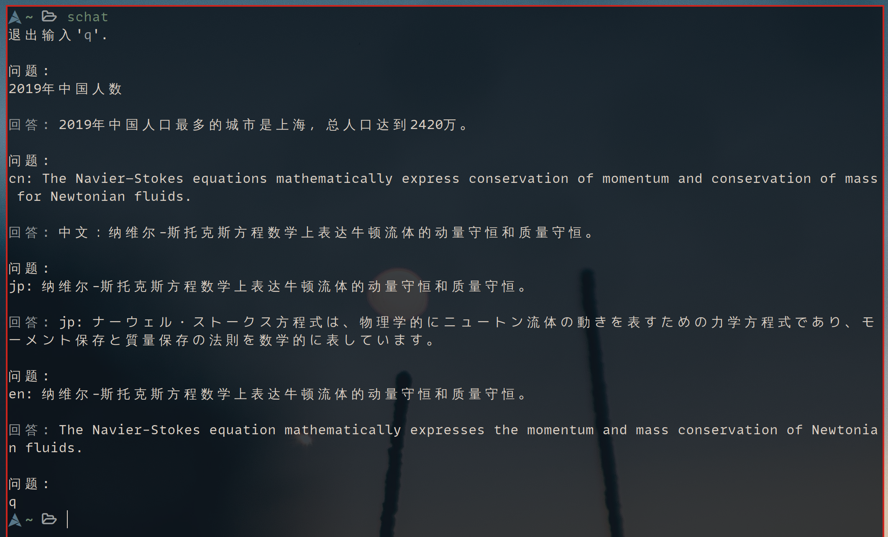

# schat

个人用终端中调用 Chatgpt.

## 安装

shell 脚本，直接下载编辑脚本，配置好 API key 就可食用.

API key [申请地址](https://beta.openai.com/account/api-keys)

## 使用



### 翻译

```console
cn: I have an apple tree    # 翻译成中文
en: 我有一颗苹果树          # 翻译成英文
jp: I have an apple tree    # 翻译成日语
```
